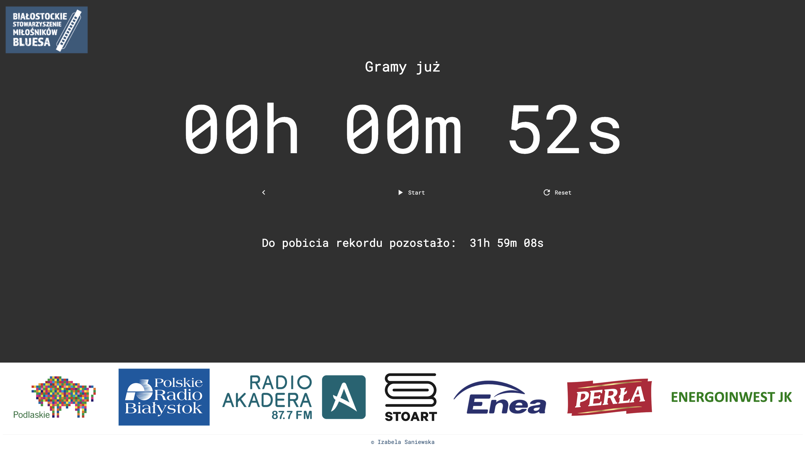

# BluesRecordBreakingTimer
JS-CSS-HTML Timer to track record breaking in playing Blues music (over 30h non-stop live concert).
In 2023 the artists played for 32 hours.

The timer was designed to be displayed on site next to the musicians on stage, hence big numbers, hidden buttons and local pure frontend-style website. 

Preview:

